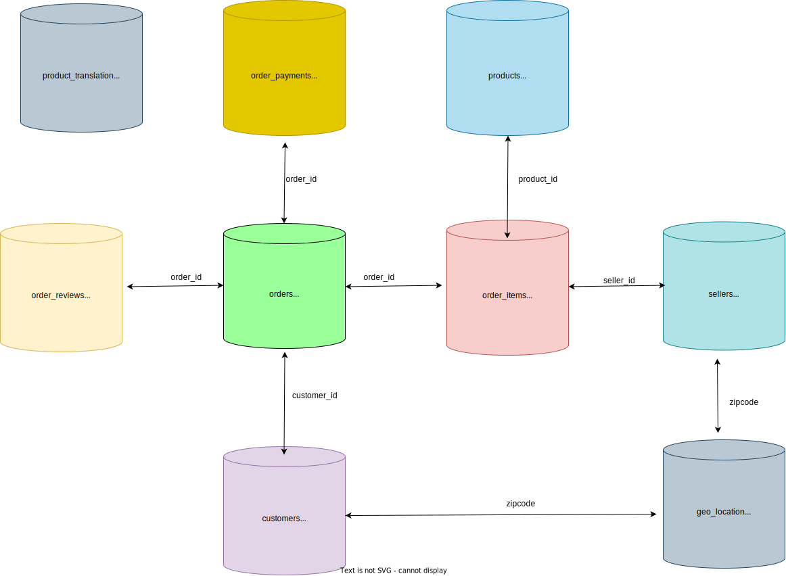

# **Olist Database Analysis**

### **About**

*`Olist` is Brazil's largest department store connecting small businesses from all over Brazil.
The data includes 100K orders from the period between Oct-2016 to Oct-2018. The database includes information
about orders associated with customers sellers their payment methods products and locations.*

*The dataset is available at Kaggle on this [link](https://www.kaggle.com/datasets/olistbr/brazilian-ecommerce?select=product_category_name_translation.csv)*

*In this project, we perform an in-depth `analysis` of customer sellers and their orders and gain some critical `insights`
about the orders volume, delivery time, valuable customer markets, important sellers by revenue, etc using `PostgreSQL`*

*We perform analysis on four major categories of data provided by Olist*

|   **Analysis**|   **Markdown**|   **Notebook**|
|---|---|---|
|   Frequency of Orders| [md](Frequency_analysis_of_orders/)   | [notebook](Frequency_analysis_of_orders/Frequency_analysis_of_orders.ipynb)  |
|   Customers| [md](Customer_analysis)  | [notebook](Customer_analysis/Customer_analysis.ipynb)  |
|   Sellers|[md](Seller_analysis/)   | [notebook](Seller_analysis/Seller_analysis.ipynb)  |
|   Products| [md](Product_analysis/)  |[notebook](Product_analysis/Product_Analysis.ipynb)|
|   Miscelleaneous| [md](Miscellaneous/)  |[notebook](Miscellaneous/Miscellaneous.ipynb)   |

### **How to install the database**

1. Install postgreSQL and pgAdmin4
2. Clone the repo or download the zipfile and extract it.
3. open pdAdmin4 go to Server > LOCAL, Right click and CREATE and enter the database name olist
4. Go to olist database again right click and open Query tools
5. Click the folder icon and open `create_table.sql` , select the entire file and execute it, this will make all required tables
6. Again go to the folder and open `import_data.sql` , replace all path with your downloaded path inside your computer
7. Select all code and execute it, this will import all data
8. Plug and play with the queries or do your own analysis
